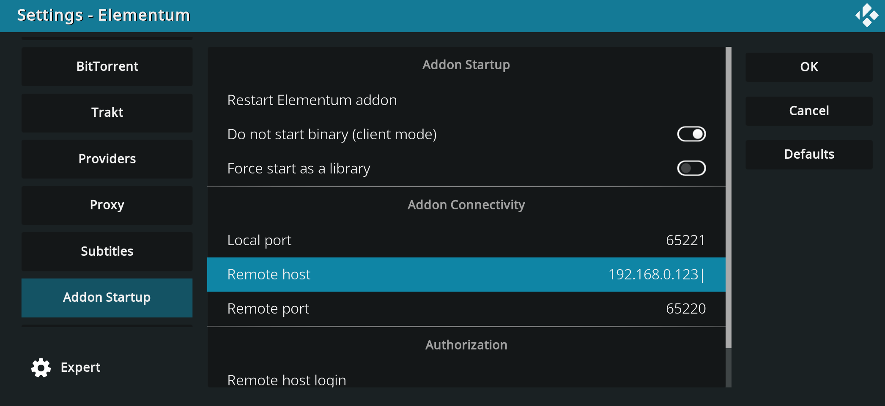

# Docker image and docker-compose service for Elementum

Since Elementum supports client-server mode, you can run Elementum in Docker either to offload processing from weak device or to use unsupported OS (like Xbox or iOS or tvOS). You even can use normally incompatible OSes as client and server, e.g. Windows and Linux.

Note: you also can run Elementun as Linux daemon or Windows service - take a look into how elementum binary is run in [Dockerfile](Dockerfile) and [docker-compose.yml](docker-compose.yml).

## Usage

### Pre-requisites

1. Follow [the official guide](https://elementum.surge.sh/getting-started/installation/) and make sure you configured Kodi as described regarding remote control.

2. In Elementum settings in "Addon Startup" tab enable "client mode" and set "Remote host" to IP of your server with Docker.
    <details>
    <summary>Screenshot</summary>

    

    </details>

### Docker

1. Install [Docker Compose](https://docs.docker.com/compose/install/) and [git](https://git-scm.com/downloads). Clone this repository:

    ``` shell
    git clone https://github.com/antonsoroko/elementum-docker.git
    cd elementum-docker
    ```

2. Copy [example.env](example.env) file to `.env` and set your values, you need to set at least `REMOTE_IP`, `ELEMENTUM_DOWNLOADS` and `ELEMENTUM_DATA`. If you want to setup library - you can share `ELEMENTUM_DATA/elementum_library/` directory with Kodi (via SMB or NFS, for example), add Movies and Shows sub-directories to Kodi as sources (the same like you in regular setup) and enable library sync in elementum via `DISABLE_LIBRARY_SYNC=false`.

3. Build and start the container

    ``` shell
    docker compose build
    docker compose up -d
    ```

4. Update code if needed: `git pull`

## Supported OSes

This "docker compose" service was tested on Linux host as Docker server (using Docker Engine) and Linux/Windows/Android host as Kodi client.
You can use several clients with 1 server.

Looks like in Windows Docker Desktop "bridge" and "host" network drivers (in WSL and Hyper-V mode) work as NAT behind the scene, so elementum can't identify Kodi's IP based on request IP since elementum sees IP of NAT gateway but not real client IP (unlike with Linux Docker Engine). Also elementum will use internal IP in replies to client and client will not be able to connect to that internal IP.
Thus, you must use special `-serverExternalIp=` parameter so elementum will use this IP in replies and will not try to identify Kodi's IP based on client's IP (`-remoteHost=` value always will be used as Kodi's IP). You will not be able to use several clients with 1 server, obviously.
Windows host as server with Docker Desktop was tested with Windows/Android host as Kodi client.

I have not tested this "docker compose" service with macOS. Most likely it either behaves like Windows (so you will need to add `-serverExternalIp=` parameter) or like Linux.

## Troubleshooting

Run docker container manually:

`docker run -it --rm --entrypoint /bin/bash elementum:latest`

and then you can use `netcat` to check network connectivity:

`nc -vz 192.168.0.10 65221`

Log file can be found in `ELEMENTUM_DATA` directory.

Also, you can enter into already running container via `docker compose exec elementum bash`, in case if you want to see what's inside.
